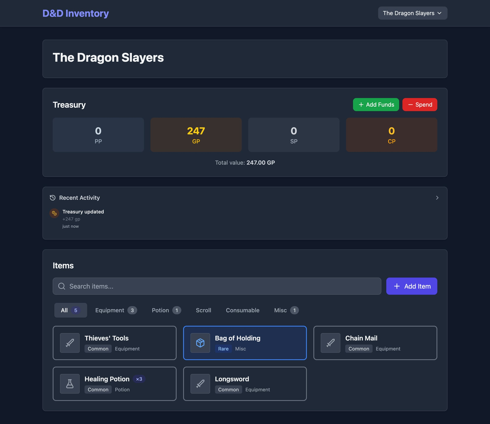

# D&D Party Inventory Manager

A collaborative web app for managing shared party inventory in D&D 5e campaigns. Players join via a unique slug link — no accounts needed. Changes sync in real-time across all connected devices.

**🎮 Try it now at [dndinventorymanager.com](https://dndinventorymanager.com)**

<!--  -->

## Features

- **Slug-based party access** — share a link, no sign-ups required
- **Real-time sync** — instant updates for all viewers via Server-Sent Events (SSE)
- **SRD 5e integration** — auto-populate item stats from the official SRD via [dnd5eapi.co](https://www.dnd5eapi.co/) GraphQL API
- **Currency tracking** — manage party gold with full transaction history
- **Full history & undo** — every change is logged; rollback to any point
- **Dark mode** — easy on the eyes for late-night sessions
- **Mobile-friendly** — responsive design, works great on phones and tablets

## Quick Start (Self-Hosting)

### Docker (recommended)

```bash
docker run -d -p 8080:80 -v dnd-data:/app/data linuxlewis/dnd-inventory-manager
```

Open **http://localhost:8080** — that's it!

Your data persists in the `dnd-data` volume across restarts and upgrades.

### Docker Compose

```bash
git clone https://github.com/linuxlewis/dnd-inventory-manager.git
cd dnd-inventory-manager
docker compose up -d
```

Access at **http://localhost:8080**.

### Configuration

| Variable | Default | Description |
|----------|---------|-------------|
| `DATABASE_URL` | `sqlite+aiosqlite:///./data/dnd_inventory.db` | Database connection string |
| `CORS_ORIGINS` | `["*"]` | Allowed CORS origins |

Override via environment in `docker-compose.yml` or `docker run -e`:

```bash
docker run -d -p 8080:80 \
  -v dnd-data:/app/data \
  -e 'CORS_ORIGINS=["https://yourdomain.com"]' \
  linuxlewis/dnd-inventory-manager
```

## Development

**Prerequisites:** [Bun](https://bun.sh/) (frontend) · [UV](https://github.com/astral-sh/uv) + Python 3.11+ (backend)

```bash
# Backend
cd backend && uv sync && uv run uvicorn app.main:app --reload --port 8000

# Frontend (in another terminal)
cd frontend && bun install && bun run dev
```

The frontend dev server proxies `/api` requests to `localhost:8000`.

## Tech Stack

| Layer | Technology |
|-------|------------|
| Frontend | React 18 · TypeScript · Vite · Bun |
| Backend | Python 3.12 · FastAPI · SQLAlchemy |
| Database | SQLite (async via aiosqlite) |
| Real-time | Server-Sent Events (SSE) |
| SRD Data | GraphQL ([dnd5eapi.co](https://www.dnd5eapi.co/)) |
| Container | nginx + uvicorn · supervisord |

## License

MIT
